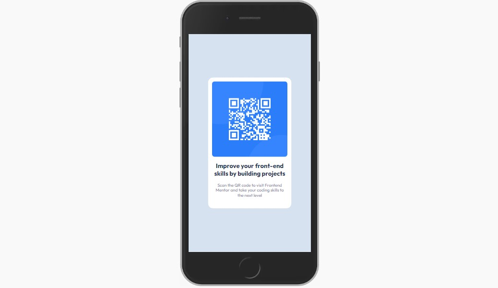

# Frontend Mentor - QR Code component solution
 
This is a solution to the [Product preview card component challenge on Frontend Mentor](https://www.frontendmentor.io/challenges/qr-code-component-iux_sIO_H/hub/qr-code-component-using-css-flexbox-kYzQt8pv7v).
 
## QR Code Component
 
- [The challenge](#the-challenge)
- [Screenshot](#screenshot)
- [Links](#links)
- [Built with](#built-with)  
- [Author](#author)
 
### The challenge
 
Users should be able to:
 
- View the optimal layout depending on their device's screen size
 
### Screenshot
 

 
### Links
 
- Solution URL: (https://www.frontendmentor.io/solutions/qr-code-component-using-css-flexbox-kYzQt8pv7v)
- Live Site URL: (https://alcantaraluan.github.io/qr-code/)
 
### Built with
 
- Semantic HTML5 markup
- CSS custom properties
- Flexbox
 
## Author
 
- LinkedIn - [Luan Alcantara](https://www.linkedin.com/in/luanpaulo/)
- Frontend Mentor - [@alcantaraluan](https://www.frontendmentor.io/profile/alcantaraluan)
 
:brazil:
# Frontend Mentor - QR Code component solution
 
Esta é uma solução que desenvolvi para um desafio proposto pelo site Frontend Mentor.
 
O desafio trata-se do seguinte projeto: [Product preview card component challenge on Frontend Mentor](https://www.frontendmentor.io/challenges/qr-code-component-iux_sIO_H/hub/qr-code-component-using-css-flexbox-kYzQt8pv7v). 
 
## QR Code Component
 
- [O desafio](#the-challenge)
- [Capturas de tela](#screenshot)
- [Links](#links)
- [Construído com](#built-with)
- [Autor](#author)
 
### O desafio
 
Os usuários devem ser capazes de:
 
- Visualizar o projeto de forma ideal, de acordo com o tamanho da tela do dispositivo
 
### Capturas de tela
 

 
### Links
 
- Solução: (https://www.frontendmentor.io/solutions/qr-code-component-using-css-flexbox-kYzQt8pv7v)
- Site com o projeto hospedado: (https://alcantaraluan.github.io/qr-code/)
 
### Construído com
 
- Marcação semântica HTML5
- Propriedades personalizadas de CSS
- Flexbox
 
### Autor
 
- LinkedIn - [Luan Alcantara](https://www.linkedin.com/in/luanpaulo/)
- Frontend Mentor - [@alcantaraluan](https://www.frontendmentor.io/profile/alcantaraluan)
 
 

